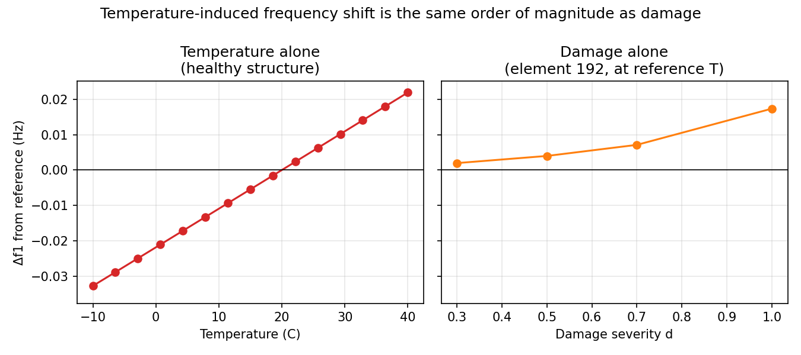
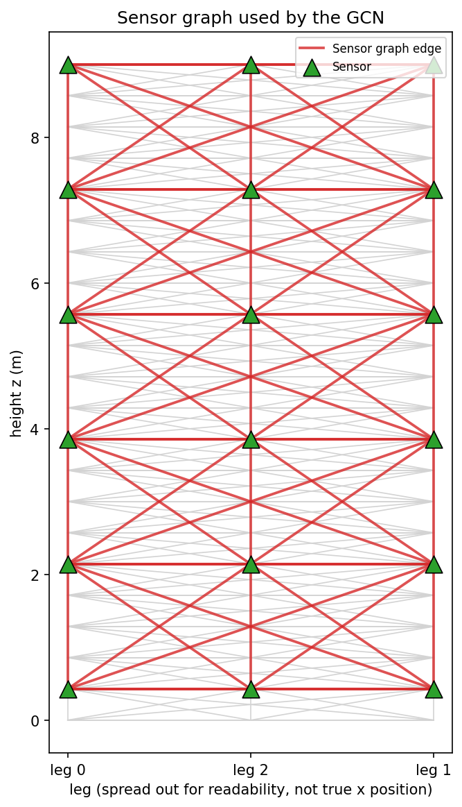
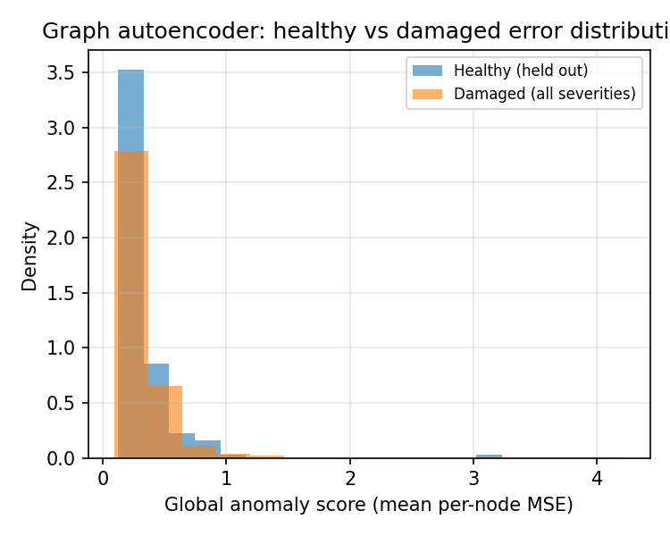
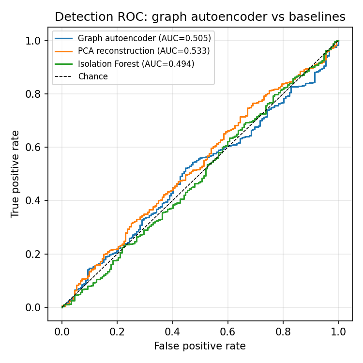
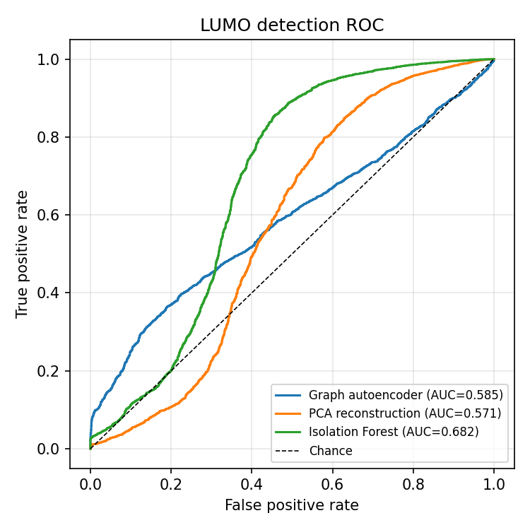
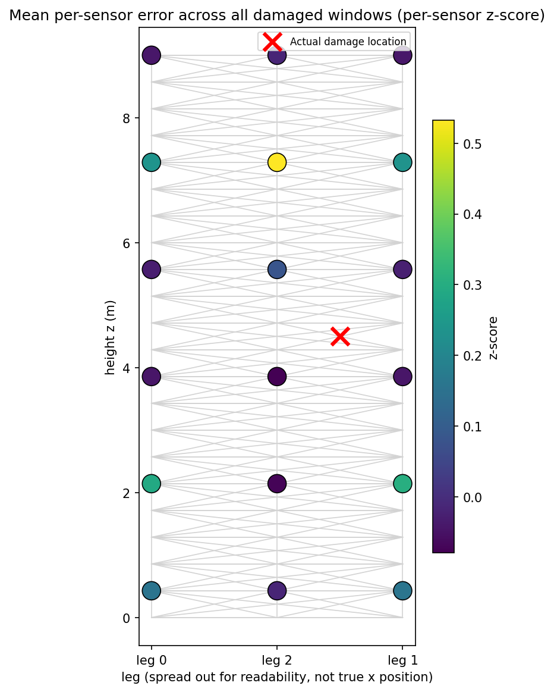
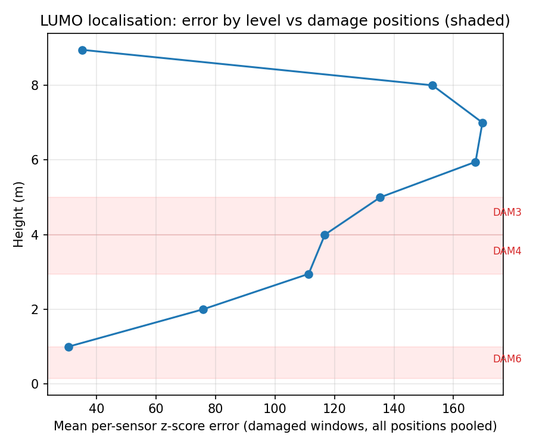

# TowerWatch: GNN-Based Damage Detection and Localisation for Lattice Towers

A five-day prototype testing whether a graph neural network, trained only on healthy vibration data, can detect and localise structural damage in a steel lattice tower. Built first on a physics-based synthetic model, then transferred unchanged to LUMO, a real, open-access test structure. A small priority stub turns the resulting anomaly signal into a ranked, cost-aware maintenance worklist.

## 1. Problem

Lattice towers (the steel masts that carry telecommunications antennas, among other things) accumulate structural degradation over years of service: loosened bolts, corroded braces, fatigue cracking. Detecting this early matters for safety and cost, but confirmed failure examples are scarce, an asset owner cannot wait for towers to fail just to build a training set.

This project uses an unsupervised approach that only needs healthy data: train a model to reconstruct normal vibration behaviour, then treat a large reconstruction error at a given sensor as evidence something changed there. It uses a graph neural network (GNN) because a tower's sensors sit on a connected physical structure, not independent locations, so a model that knows that structure can point to *where* something changed, not just *whether*.

## 2. Approach

Three stages, in this order, mirroring a real constraint: abundant simulation, scarce real labelled failure data.

1. **Synthetic stage.** Build a physics-based 3D truss finite-element model of a 9 m lattice mast (`src/fem/`), inject damage as brace stiffness loss, simulate accelerometer response under wind-like excitation with a temperature-driven stiffness confounder (`src/simulate/`), extract per-sensor vibration features (`src/features/`), and train a graph autoencoder (`src/models/gcn_ae.py`) on healthy windows only.
2. **Real stage.** Transfer the same pipeline, unchanged, to LUMO, a real, open-access 9 m steel lattice mast with physically induced, removable-brace damage and outdoor environmental variability (`src/data/lumo.py`).
3. **Prioritisation stage.** Combine the anomaly score, estimated damage location, and a severity trend into one ranked maintenance-priority table, with a naive inspection-cost-versus-risk tradeoff (`src/evaluate/priority.py`).

No PyTorch Geometric, no Lightning, no Hydra: the GCN layer is about fifteen lines of plain PyTorch (a dense normalised-adjacency matmul), keeping the dependency surface small enough to `pip install -r requirements.txt` and run.

## 3. Results

### 3.1 Detection

ROC-AUC (1.0 perfect, 0.5 no better than a coin flip), held-out healthy versus damaged, pooled across all damage cases:

| Method | Synthetic (750 instances, 3,000 windows) | LUMO (real data) |
|---|---|---|
| Graph autoencoder | 0.505 | 0.585 |
| PCA reconstruction | 0.533 | 0.571 |
| Isolation Forest | 0.494 | 0.682 |

Both land close to chance overall. On LUMO, detection varies a lot by damage position: the graph autoencoder scores 0.694 at DAM3 but drops to 0.481, below chance, at DAM6 (Section 4).

### 3.2 Localisation

Top-3 accuracy and mean rank are standard retrieval metrics, used here for localisation: how often the true damage location is among the model's 3 highest-error picks, and how far down the ranked list it falls on average. Both tables below include a random-guess baseline row for reference.

**Synthetic** (single fixed damage location, 750 instances):

| Method | Top-3 accuracy | Mean rank |
|---|---|---|
| Autoencoder, raw error | 0.9% | 11.4 |
| Autoencoder, per-sensor z-score | 13.0% | 8.5 |
| Per-sensor (no-graph) architecture, z-score | 10.4% | 7.3 |
| ARX (autoregressive with exogenous input), per-sensor z-score | 18.8% | 7.8 |
| Autoencoder z-score + physics-informed sensitivity weight | 4.5% | 9.5 |
| Supervised classifier, same location it was trained on | 50.7% | 3.8 |
| Supervised classifier, held out from training entirely | 7.5% | 12.5 |
| *Random-guess baseline* | *16.7%* | *8.5* |

**LUMO** (real damage, per-sensor z-score):

| Position | Top-3 accuracy | Mean rank |
|---|---|---|
| DAM3 | 56.0% | 2.4 |
| DAM4 | 38.5% | 3.3 |
| DAM6 | 7.0% | 6.4 |
| *Random-guess baseline* | *33.3%* | *4.0* |

### 3.3 Temperature confounder



Sweeping temperature across a realistic outdoor range (−10°C to 40°C) shifts the synthetic tower's first natural frequency by about as much as fully removing a structural brace does. A workable detector has to tell these two causes apart, not just react to frequency shift (Section 4 covers how much this mattered on real data too).

### 3.4 Maintenance-priority ranking

`scripts/06_priority_ranking.py` scores every already-evaluated instance (657 total: 638 synthetic, 19 LUMO) with its already-trained model, combines a current anomaly score, a severity trend (slope of anomaly score across that instance's own windows), and a naive cost line, then writes the ranked table to `figures/priority_ranking.csv`. Top 5:

| Rank | Source | Instance | Ground truth | Priority score | Localisation | Inspection cost (AUD) | Risk of delay (AUD) |
|---|---|---|---|---|---|---|---|
| 1 | synthetic | synthetic-348 | damage severity 0.5 | 6.18 | sensor node 64 (~9.0 m up) | 1,340 | 30,877 |
| 2 | synthetic | synthetic-178 | damage severity 0.3 | 2.79 | sensor node 64 (~9.0 m up) | 1,340 | 13,967 |
| 3 | synthetic | synthetic-371 | damage severity 0.5 | 1.56 | sensor node 64 (~9.0 m up) | 1,340 | 7,787 |
| 4 | synthetic | synthetic-270 | damage severity 0.3 | 1.05 | sensor node 4 (~0.4 m up) | 826 | 5,231 |
| 5 | synthetic | synthetic-632 | damage severity 1.0 | 0.78 | sensor node 63 (~9.0 m up) | 1,340 | 3,877 |

All dollar figures are placeholders (Section 6); Section 4 covers what this table does and doesn't actually demonstrate.

## 4. What worked, and what didn't

**Worked:**
- The same feature extraction, graph autoencoder, and evaluation code runs unchanged on both datasets: nothing in `src/features/`, `src/models/`, or `src/evaluate/` special-cases either one.
- The temperature confounder is real and large on synthetic data (Section 3.3), and detrending it measurably helped the graph autoencoder on real LUMO data too (0.585 to 0.704 pooled AUC), a partial real-data confirmation of the synthetic finding.
- Comparing each sensor's error to its own healthy history (a per-sensor z-score), rather than raw error across sensors, measurably improves localisation on both datasets. This held up on real data, not just in simulation.
- A per-sensor autoencoder (no graph at all; Jiang et al. 2021, Giglioni et al. 2022, reviewed in Eltouny, Gomaa & Liang 2023) outperformed the plain GCN on LUMO's real data, on detection and both localisation measures, and fixed the graph model's worst result (DAM6: 0.481 to 0.742 AUC).
- The priority stub demonstrates the intended shape: one ranked table spanning both datasets, with an explicit inspect-now-versus-wait cost comparison per row.

**Didn't:**
- Detection stayed close to chance overall on both datasets; no method here is close to deployment-ready on its own.
- A supervised classifier localises very well at a location it was trained on (50.7% top-3) and collapses below the random-guess baseline at one it wasn't (7.5%). This is the project's clearest negative finding: the best-looking number in the project doesn't survive a genuinely new damage location. A 12-location leave-one-out test confirmed it: the average across all 12 folds reaches only 15.7% top-3, against a 16.7% baseline.
- DAM6 (LUMO) resisted every fix tried: detection at chance or below, and the per-sensor z-score fix that helps everywhere else makes its localisation worse. The likely explanation is a combination of the smallest sample size (5 recordings) and a location near the tower's fixed base, where Stage 1's physics work already showed damage matters least, but this couldn't be fully confirmed with the data collected here.
- The priority ranking's cross-dataset comparison is weaker than it looks: every LUMO instance ranks between position 325 and 645 of 657, none crack the top 300. That's not because LUMO's damage is less urgent, each dataset's autoencoder produces errors on its own arbitrary scale, an artefact of its own training, and the priority score was never calibrated to make those scales comparable. A genuinely damaged LUMO block can even rank near the bottom if its short window-to-window trend happens to be negative, exactly the gap the "illustrative, not calibrated" framing anticipated, now backed by a concrete number.
- Some healthy synthetic instances rank inside the top 20 by priority score (the highest at rank 15 of 657), a visible false positive: with detection barely above chance, the ranking built on top of it inherits that weakness.
- An ARX (autoregressive with exogenous input) model, an approach Shahidi et al. (2015, cited in Eltouny, Gomaa & Liang 2023) found gave the best localisation of four methods compared on a physical steel test frame, didn't repeat that result here: detection landed below chance (AUC 0.459), and localisation, though a little better than a random guess, didn't clear this project's bar for a convincing result. The likely reason: ARX works on the raw time-domain signal, not the specific frequency band this project's own feature engineering already identified as the one place a real damage signal lives, so it can't focus on the one band that matters.
- Combining the autoencoder's z-score with a physics-derived per-sensor weight (modal strain energy from the tower's own stiffness and mass matrices, Pandey, Biswas & Samman 1991; Stubbs & Kim 1996) made localisation clearly worse (top-3 13.0% down to 4.5%). The weight comes out highest right next to the tower's fixed base, an ordinary boundary-condition effect, but this project's one fixed damage case sits near the middle of the tower. A weight that doesn't depend on where the damage actually is can only help when it lines up with the real location, and here it pulled attention the wrong way.

## 5. Operational framing

Peak ROC-AUC isn't the number that matters operationally. A false positive means an unnecessary truck roll and climb crew, costly and, given tower climbing's safety record, not risk-free. A false negative means undetected degradation on a structural member. The operating point, not the AUC, is what an asset owner actually has to live with.

False alarm rate at a fixed 90% detection rate (using the trained graph autoencoder, no retraining, window-level):

| Dataset | ROC-AUC | False alarm rate at 90% detection |
|---|---|---|
| Synthetic | 0.505 | 94.7% |
| LUMO | 0.585 | 89.9% |

To catch 9 in 10 real damage cases with either model as currently trained, roughly 9 in 10 healthy readings would also have to be flagged. Neither model supports a usable 90%-detection operating point today.

Choosing a workable threshold needs two things this project can't supply on its own: an explicit relative cost of a missed detection versus a false alarm (the priority stub in Section 3.4 is a stand-in for that number, not a real one), and enough confirmed-damage examples to validate a chosen threshold before relying on it. That second requirement is the same scarce-data problem this project's unsupervised approach was chosen to work around, which is why the operating point can't simply be read off a synthetic ROC curve.

## 6. Limitations

- Five-day prototype, not research. No claim of novelty.
- LUMO is a scaled research mast (9 m), not a real telecommunications tower.
- Simulated wind loading (band-limited Gaussian excitation) is a proxy for real ambient loading, not a validated wind model, and no real corrosion or fatigue mechanisms are modelled, only brace stiffness reduction.
- The priority ranking is illustrative, not calibrated: the cost figures are placeholders, and Section 4 shows a concrete case where the ranking isn't comparable across datasets. No real cost data, scheduling optimisation, or multi-period planning is in scope.
- The synthetic dataset's main results use one fixed damage location; Section 4's generalisation tests use additional, separately simulated locations with fewer instances each. LUMO has only 5 recordings per real damage position.
- Most LUMO results come from a single trained model, not averaged over several seeds the way synthetic results are. This matters in practice: retraining the same GCN on the same LUMO data and seed moved the pooled detection AUC by about 0.01, small next to the gaps between architectures, but real, so a single LUMO run shouldn't be read as a precisely settled number.
- The priority stub's "severity trend" is a slope across a handful of consecutive-second windows within one instance or 10-minute recording, not a real longitudinal degradation-rate estimate: it demonstrates the shape of that input, not a validated trend detector.

## 7. Citation

LUMO dataset: Wernitz, T., Hofmeister, B., Jonscher, C., Grießmann, T., Rolfes, R. (2021). *LUMO, Leibniz University Test Structure for Monitoring.* Leibniz Universität Hannover. https://doi.org/10.25835/0027803 (CC-BY 3.0).

---

## Appendix: figures

**1. Tower geometry, sensors, and the sensor graph.** The synthetic tower's structural members (faint background), the 18 simulated sensor locations, and the graph edges the GCN actually propagates over, distinct from the physical members.



**2. Temperature versus damage.** Discussed in Section 3.3.

**3. Healthy versus damaged error distributions**, synthetic graph autoencoder.



**4. ROC curves, all models, both datasets.**




**5. Localisation heat maps**: synthetic (per-sensor z-score) and LUMO (error by height, real damage positions marked).




## Appendix: reproducing every figure

Needs Python 3.10+ and the packages in `requirements.txt`. LUMO's data is not included in this repository (three ZIPs, 500 to 650 MB each); download `exemplary_datasets_dam3_111.zip`, `exemplary_datasets_dam4_111.zip`, and `exemplary_datasets_dam6_111.zip` from https://data.uni-hannover.de/dataset/lumo and unzip all three into `data/lumo/exemplary_datasets/` (the `lumo:` section of `configs/default.yaml` points at this folder).

```bash
python -m venv .venv && source .venv/bin/activate
pip install -r requirements.txt

python scripts/01_generate_synthetic.py   # ~35-45 min: builds the tower, runs Sec 4/5's checks, simulates 750 instances
python scripts/02_extract_features.py     # under a minute: features, Sec 5.3's checks, figure 2
python scripts/03_train.py                # ~1-2 min: trains the graph autoencoder + baselines
python scripts/04_evaluate.py             # a few seconds: figures 3, 4 (synthetic), 5 (synthetic)
python scripts/visualize_sensors.py --no-show   # figure 1
python scripts/05_lumo_transfer.py        # a few minutes: LUMO features, training, figure 4 and 5 (LUMO)
python scripts/06_priority_ranking.py     # a few seconds: figures/priority_ranking.csv, Section 3.4 / 5
```

Everything above reuses only saved model artefacts under `models/` (not committed, regenerated by the scripts above); nothing is retrained twice. Optional follow-up experiments (architecture comparisons, the supervised classifier, multi-location and leave-one-location-out tests, the LUMO scoring comparisons) live in `scripts/day3_*.py` and `scripts/day4_*.py`, each independently runnable and documented in its own module docstring.
